build-lists: true

# How to fit a million ✨ into a 📱


---
## Content

* general points on optimization
* example problem
* some details on MemoryLayout of Structs in C/Swift
* Swift struct example optimization
* pretty results (hopefully)

---

## Why Optimize Code?

* shorter loading times


^• happier users

---

## Why Optimize Code?


* improve quality
  * graphics
	* sound
	* AI ...  

^• same but better -> happier users

---

## Why Optimize Code?


* battery power
* every cpu cycle on mobile costs power (and $$$ when on server)
* sometimes 0fps -> good thing

---

## Why Optimize Code?

* enable advanced features


^• impossible without optimization
• maybe show Pyramid of user happiness
• maybe talk about 0fps board game example

---

## What to Optimize?

* cpu cycles 
* memory 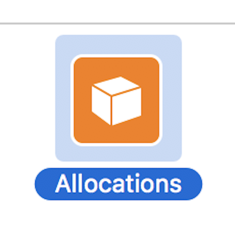

* sometimes those go together, sometimes against each other

---

## How?

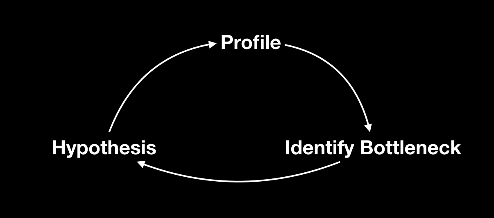

* Unit tests features so we don't break them during the loop


---

# ⚡️Premature Optimization⚡️

> We should forget about small efficiencies, say about 97% of the time: _premature optimization is the root of all evil_. Yet we should not pass up our opportunities in that critical 3%."

Donald Knuth

--- 

# ⚡️Premature Optimization⚡️

We want to write:

1. Understandable, safe and testable code (DRY, KISS etc)
2. Optimize as _needed_

* programming time is 💰
* faster code often more complex (💰)
* -> pick your battles


---

## Intermission: Swift Compiler

* we can also apply the same steps to swift project compilation time

```
xcodebuild -project App.xcproj -scheme App clean build
 OTHER_SWIFT_FLAGS="-Xfrontend -debug-time-function-bodies" | 
 grep "[0-9][0-9]\.[0-9]*ms" | sort -nr > culprits.txt
```

---

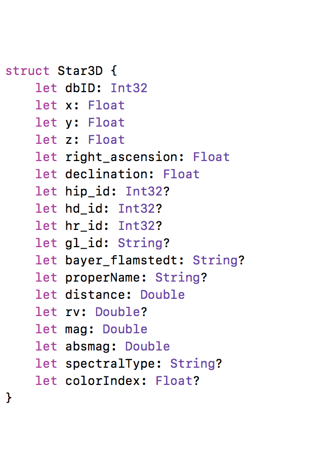

## Main Example


* large database of stars
* many columns
* `MemoryLayout<Star3D>.size`
* `// 217`
* `MemoryLayout<Star3D>.stride`
* `// 224`
* 8000 x ⭐️  ~ 1.8 MB 🙂

* 120000 x ⭐️  ~ 27 MB 😐
* 2.5mil x ⭐️  ~ 560 MB 😣

^•visible with naked eye
• Hipparcos catalogue 
• Tycho2 - db of 2.5 million brightest (1993)

---

## Seperate Spatial Data from Rest

```
struct Star3D {
    let dbID: Int32
    let x: Float
    let y: Float
    let z: Float
    let starData: Box<StarData>?
}
```

* only x/y/z needed for spatial tree structure
* significantly reduces size of tree and increases tree lookup performance
* Box is `Unmanaged` / `Unretained` to speed up Tree-Algorithm 🚨

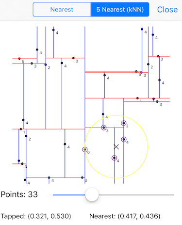

---

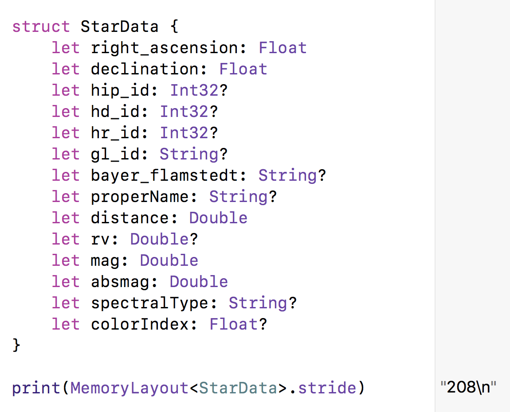
## Basic (Unoptimized?) Struct

* Overall stride of 208 Byte
  
* actually though this was _sort of_ optimized, as

* `print(Int8.max) // 127`
* `print(Int16.max) // 32767`
* `print(Int32.max) // 2147483647`
* `print(Int.max) // 9223372036854775807`

^as we all remember Int sizes use different amount of bytes
looks optimal, used the right integer sizes
with these sizes, let's look at more detail

---

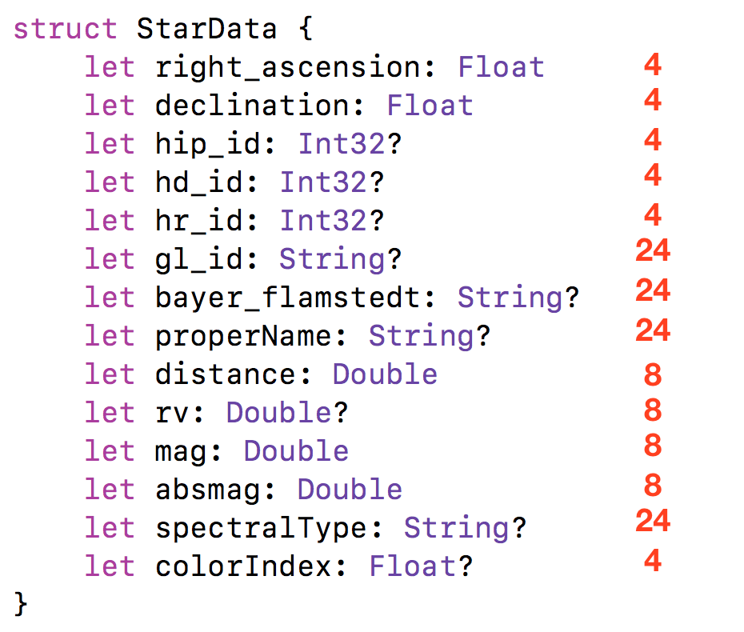

## Quick Check

* `print(MemoryLayout<X>.size)`
  
* Float, Int32 : 4 Byte

* Double: 8 Byte

* String: 24 Byte

* `24*4 + 8*4 + 4*6 = 152`

* 152 != 208 

* 😳 

--- 

## Our favorite Swift Type 

```
enum Optional<Wrapped> {
    case none
    case some(Wrapped)
}
```

* Adds 1 Byte
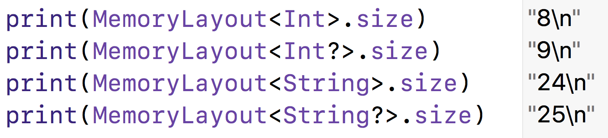

---

## No Optionals

* let's use default value instead of nil (`-1`,`""`)

* still be safe by using `private` members and public getters

```
public func getHipId() -> Int? {
    return hip_id != -1 ? hip_id : nil
}
```

^make sure -1 is never used,
in my case I actually store it as a static variable and compare the variable


---

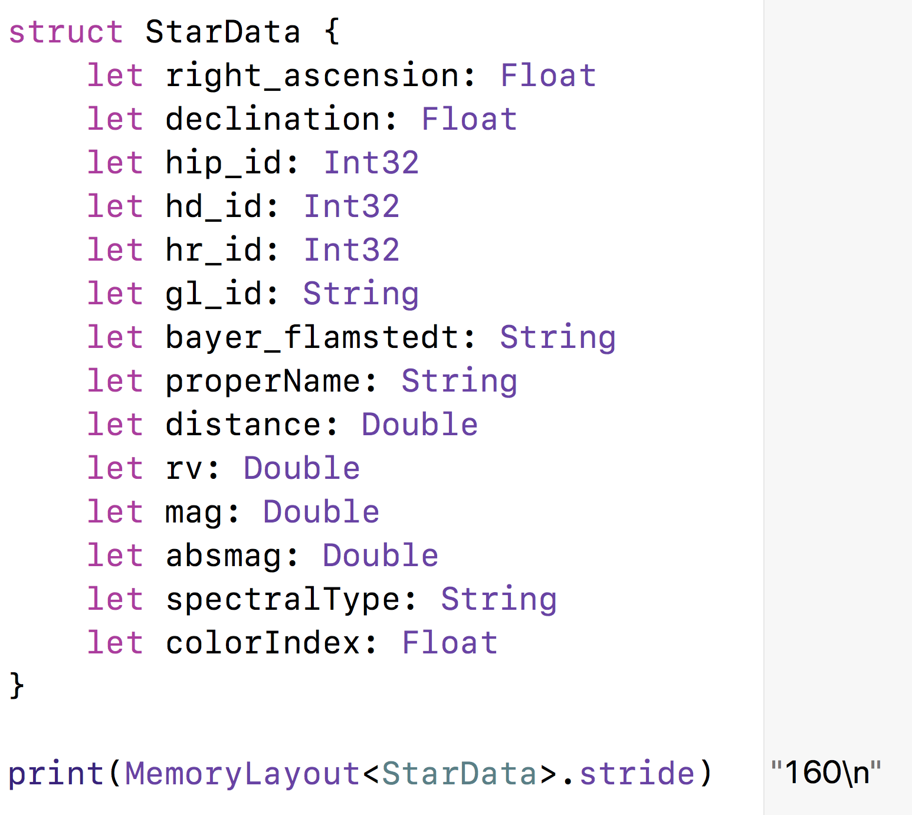

## Struct without Optionals

* wait, what?

* `208 - 160 != 9 * 1`

* we removed 9 Optionals and gained 48 Byte 🤔


--- 

# Alignment (C Knowledge to the Rescue!)

* modern CPU's lay out data types so memory access is fast

* each type has a _memory aligment_
  1. `char` can start anywhere
  2. `short` can start on even bytes
  3. `float` can start on 4/8/12/16/...
  4. ...


--- 

# Alignment (Swift)

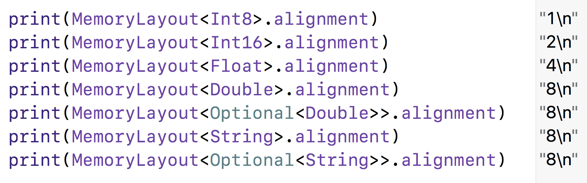

--- 

# Padding

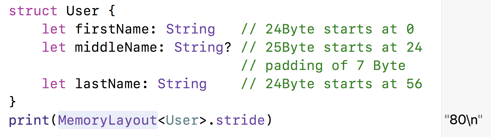

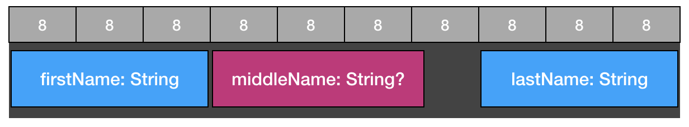

--- 

# Bad Alignement Example

```
struct BadAligned {
    let isHidden: Bool
    let size: Double
    let isInteractable: Bool
    let age: Int
}
print(MemoryLayout<BadAligned>.stride) // 32Byte
```


--- 

# Better Alternative
```
struct WellAligned {
    let isHidden: Bool
    let isInteractable: Bool
    let height: Double
    let age: Int
}
print(MemoryLayout<WellAligned>.stride) // 24Byte
```


^it's nice isn't it?
Like playing tetris ;)


--- 

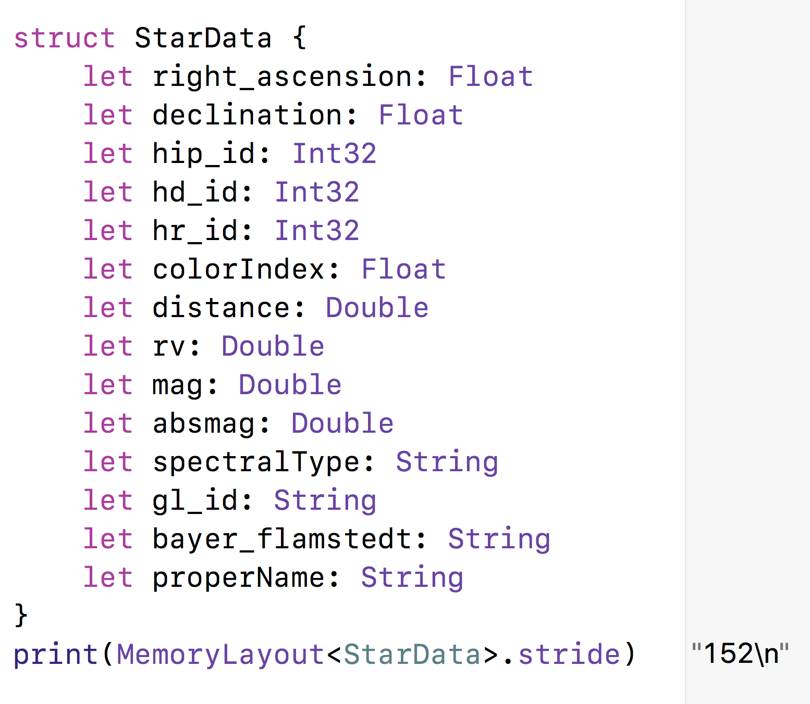

# Aligned StarData

* Optionals + Alignement: 

* 208 -> 152


---

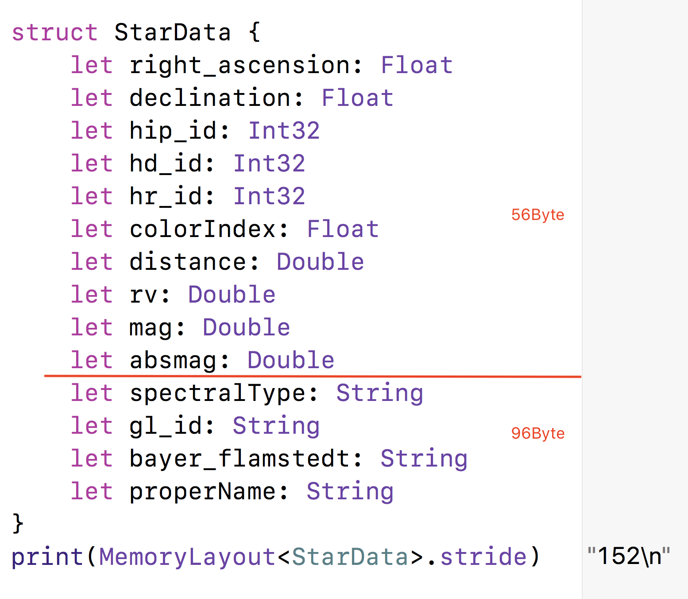

## Use Domain Knowledge

* biggest chunk of data are the Strings!

* turns out many strings are empty

* only 146 stars have proper names

* 3801 unique Gliese Id's

* 3064 Bayer Flamstedt Designations

* 4307 different Spectral Types (could be cleaned up)

---

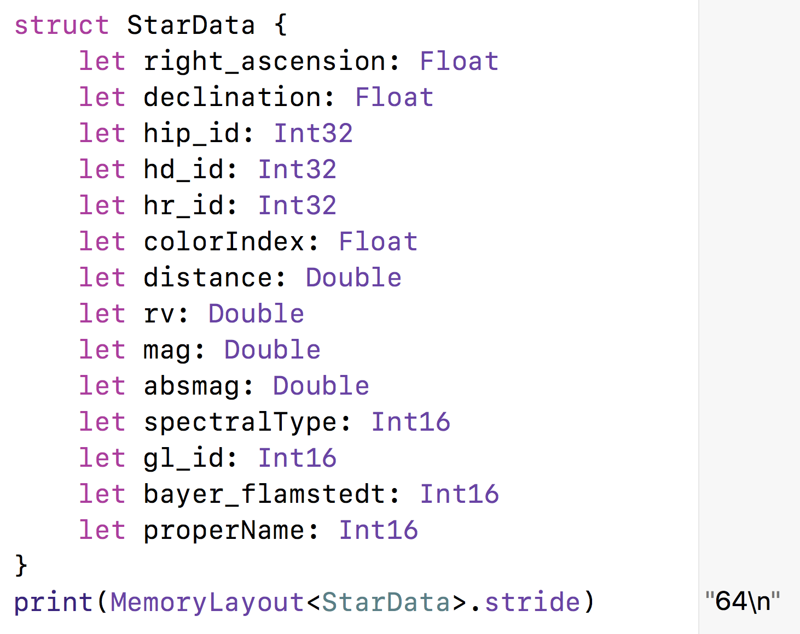

## Spare Strings into separate Dictionaries

* during loading of database, index unique instances of strings

* create nice accessor's to hide implementation detail

```
func getGlId() -> String? {
    return gl_id != -1 ? DB.glIds[Int(gl_id)] : nil
}
```

* are we done?

---

## Alignement one more time

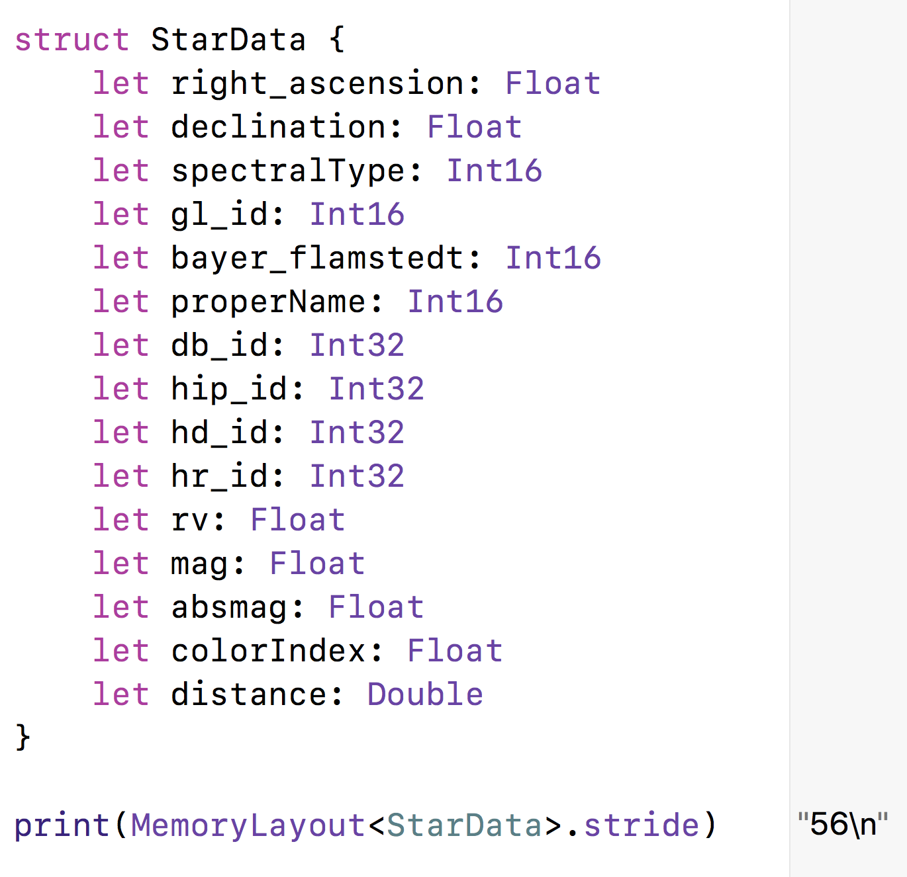

---

## Final Result

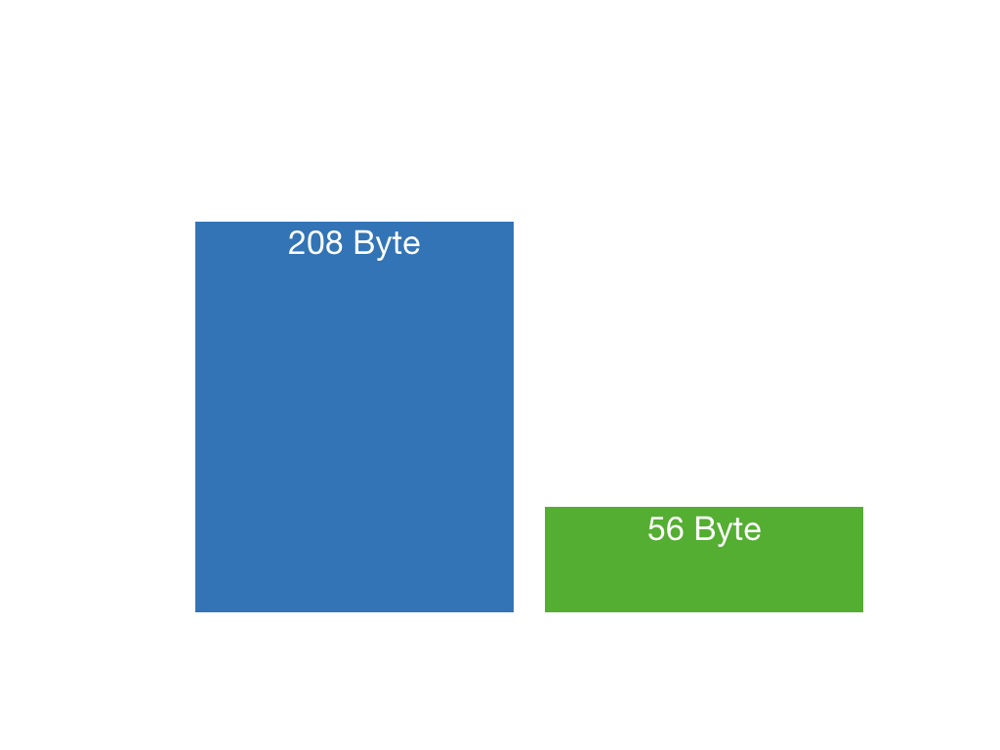

^looks great but
again, this is not about the numbers
but about getting more out of our app -> more stars

---
## premature optimization is the root of all evil[…]

Examples (When to not use what we just learned):

* set of 20 users ⚠️
* media library of 1000 movies ⚠️
* Server-Side Swift with > 10^6 entries ✅
* idk procedurally generated content in a game ✅
* points of interest in MapKit ✅

---
## Server-Side Swift Example

* getting lot's of data into a small machine works especially well on Servers

* example: https://github.com/Bersaelor/StarsOnKitura / https://starsonkitura.eu-de.mybluemix.net


---
## What did we learn today

* pick your battles wisely!

* play Tetris with Struct `var`s when necessary

* know your domain to utilize it's properties


---
## Links

* Premature Optimization http://wiki.c2.com/?PrematureOptimization
* The Lost Art of C Structure Packing http://www.catb.org/esr/structure-packing/
* Writing High-Performance Swift Code https://github.com/apple/swift/blob/master/docs/OptimizationTips.rst
* KDTree / Stars at Functional Swift https://www.youtube.com/watch?v=CwcEjxRtn18


--- 

## Thank you

* github.com/Bersaelor
* twitter.com/bersaelor