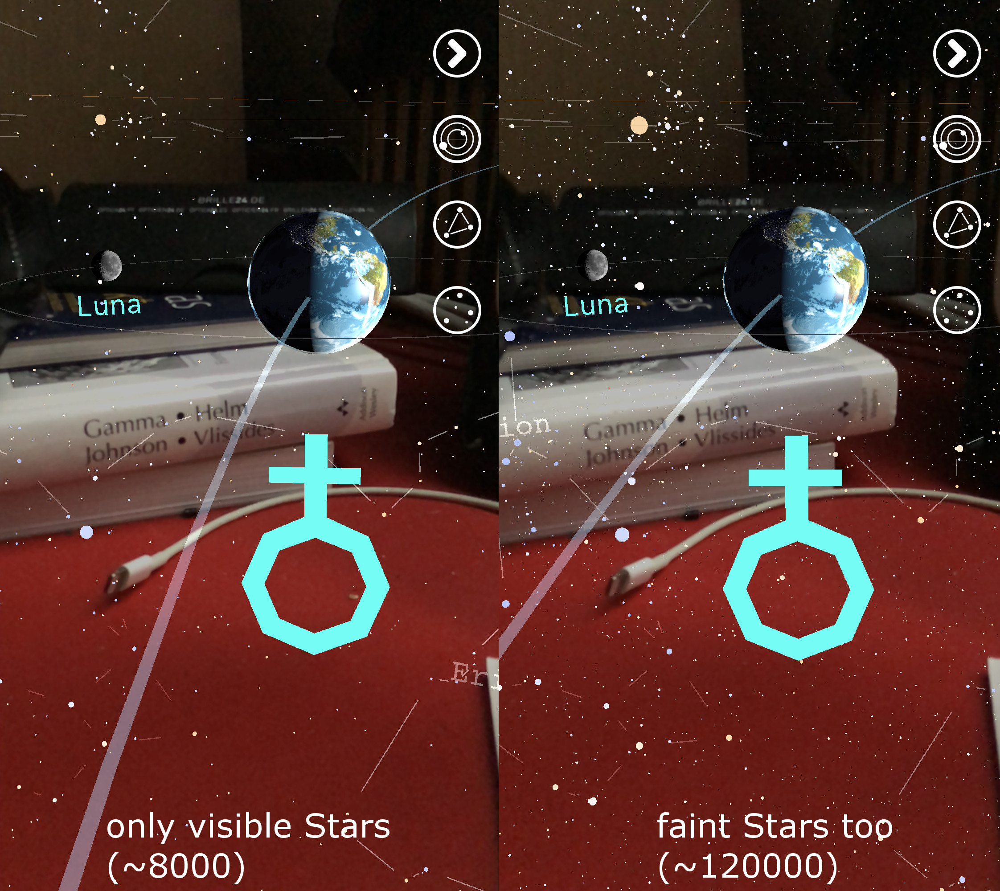
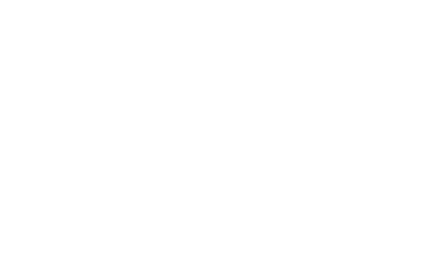

build-lists: true

# How to fit a million ✨ into a 📱


---
## Content

* general points on optimization
* example problem
* Swift struct example optimization
* pretty results (hopefully)

---

## Why Optimize Code?

* shorter loading times


^• happier users

---

## Why Optimize Code?


* improve quality
  * graphics
	* sound
	* AI ...  

^• same but better -> happier users

---

## Why Optimize Code?


* battery power
* every cpu cycle on mobile costs power (and $$$ when on server)
* sometimes 0fps -> good thing

---

## Why Optimize Code?

* enable advanced features



^• impossible without optimization
• maybe show Pyramid of user happiness
• maybe talk about 0fps board game example

---

## What to Optimize?

* cpu cycles 
* memory 

* sometimes those go together, sometimes against each other

---

## How?



* Unit tests features so we don't break them during the loop


---

# ⚡️Premature Optimization⚡️

> We should forget about small efficiencies, say about 97% of the time: _premature optimization is the root of all evil_. Yet we should not pass up our opportunities in that critical 3%."

Donald Knuth

--- 

# ⚡️Premature Optimization⚡️

We want to write:

1. Understandable, safe and testable code (DRY, KISS etc)
2. Optimize as _needed_

* programming time is 💰
* faster code often more complex (💰)
* -> pick your battles


---

## Intermission: Swift Compiler

* we can also apply the same steps to swift project compilation time

```
xcodebuild -project App.xcproj -scheme App clean build
 OTHER_SWIFT_FLAGS="-Xfrontend -debug-time-function-bodies" | 
 grep "[0-9][0-9]\.[0-9]*ms" | sort -nr > culprits.txt
```

---


## Main Example


* large database of stars
* many columns
* `MemoryLayout<Star3D>.size`
* `// 217`
* `MemoryLayout<Star3D>.stride`
* `// 224`
* 8000 x ⭐️  ~ 1.8 MB 🙂

* 120000 x ⭐️  ~ 27 MB 😐
* 2.5mil x ⭐️  ~ 560 MB 😣

^•visible with naked eye
• Hipparcos catalogue 
• Tycho2 - db of 2.5 million brightest (1993)

---

## Seperate Spatial Data from Rest

```
struct Star3D {
    let dbID: Int32
    let x: Float
    let y: Float
    let z: Float
    let starData: Box<StarData>?
}
```

* only x/y/z needed for spatial tree structure
* Box is `Unmanaged` / `Unretained` to speed up Tree-Algorithm 🚨


---

## The Base Situation

```
struct StarData {
    let right_ascension: Float
    let declination: Float
    let hip_id: Int32?
    let hd_id: Int32?
    let hr_id: Int32?
    let gl_id: String?
    let bayer_flamstedt: String?
    let properName: String?
    let distance: Double
    let rv: Double?
    let mag: Double
    let absmag: Double
    let spectralType: String?
    let colorIndex: Float?
}

print(MemoryLayout<StarData>.stride) // 208
```

---

## String


--- 

## Optional


--- 

## Alignment


---
## premature optimization is the root of all evil[…]

Examples:
* set of 20 users ⚠️
* media library of 1000 movies ⚠️
* Server-Side Swift with > 10^6 entries ✅
* idk procedurally generated content in a game ✅
* points of interest in MapKit ✅


---
## What did we learn today


---
## Links

*
*

--- 

## Thank you

* github.com/Bersaelor
* twitter.com/bersaelor