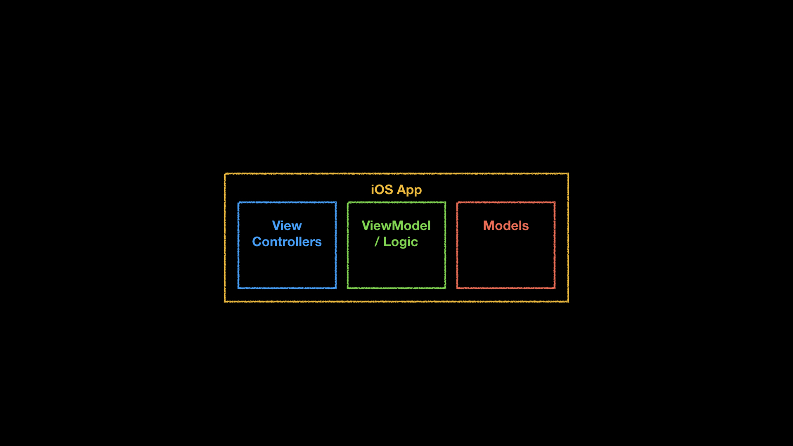
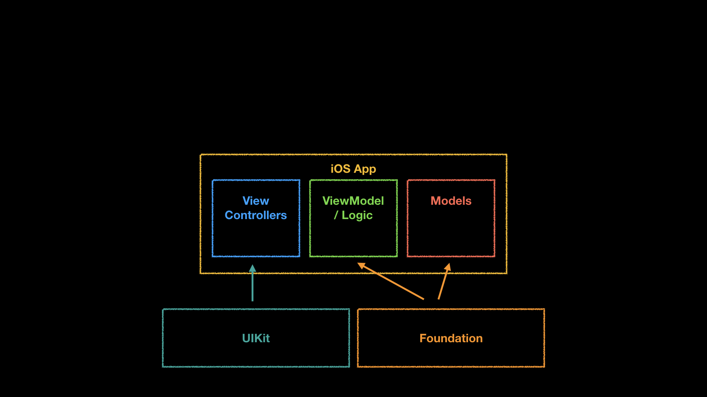
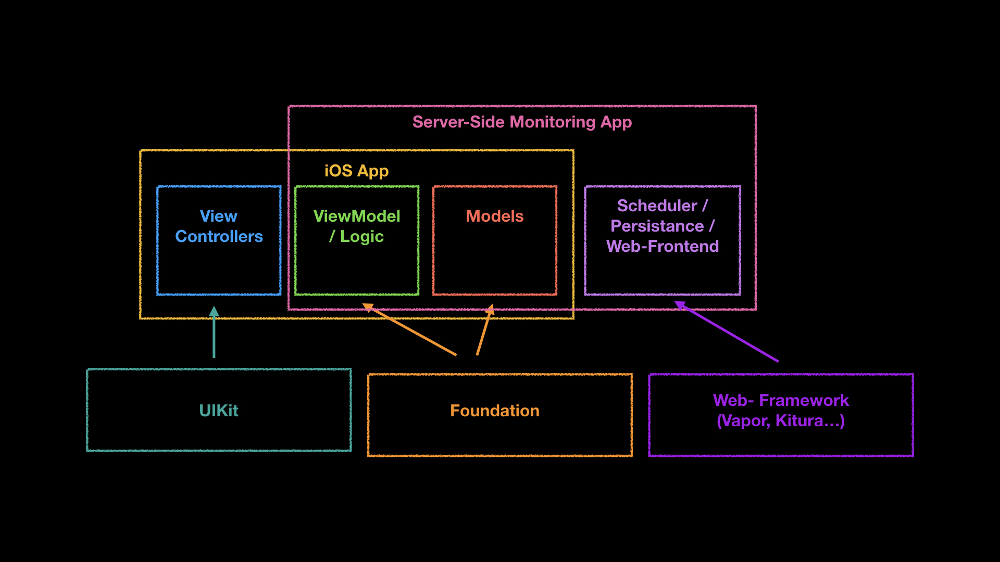

build-lists: true

## Mobile Swift 👬 Server-Side Swift


---

## Who am I?


- one-man agency @ mathheartcode.com 
- co-founder @ looc.io 
- iOS apps for 9 years (,, ,,)
- some minor server work in RoR & Python 
- studied math, so 🎉 for the functionalness of 
- 🎉 to become  full-stack
- Konrad Feiler ( konrad@looc.io )


---

## Client <-> Backend


- Facebook, Twitter, AirBnb, Kickstarter, Amazon, Netflix, Twitch, Spotify, WhatsApp ...

^^questions:
How many of you have written an iOS app?
How many of those were client apps?


---

## Client <-> Backend

- RESTful API
- JSON responses
- as of Swift 3: `Codable`


^^questions:
How many of you have interfaced with RESTful JSOn Api's?
Adoption of alternatives like GraphQL is slow

---

## Client ⛈ Backend

- API is slow
- endpoints unreachable
- values are `null`
- arrays are `[]`
- `"key" = "value",` missing entirely
- images are wrong/missing

^^how many of you have encountered these problems
^^what happens when any of those issues occur to a live app?

---


[.footer: imgflip.com]

---

## Example Stories

- "Hey app devs, the project page is slow! 😡"
- "Hey app devs, this show has no episodes! 😡"
- "Hey app devs, the XYZ has no title/subtitle/image! 😡"
-> 70% of the bug tickets for mature apps!

^^we use `?` when unwrapping jsons to prevent even worse !


---

## Bug fix process

- users/qa reports -> ticket for mobile dev
- mobile dev replicates (same test device, test correct language settings, vpn to region ...)
- mobile dev finds problematic URL/endpoint
- mobile client dev -> ticket for Backend-Team
- backend team fixes issue

^^maybe good QA can start app in Xcode or uses charles
^^this is the ideal scenario, often problems are transient and go back and forth multiple times

---

## ⛈

- long time between discovery of issue and fix
- humans have to discover the problems
- some backend teams have monitoring tools, but often not very detailed
- monitoring tools check A, apps request B

---

# 🤔

- iOS project contains all information to:
  - produce exact urls
  - validate and parse JSON responses
- we test our code, why not test our api?

^^now, we don't want to use a phone connected to an outlet somewhere to continously poll our api, but we don't have to

---

### typical MVVM iOS Architecture




---

### framework importing on iOS



---



---

## Advantages


+ reuse existing code 
+ monitoring tool always up to date
+ fetch and parse exactly as the app is
+ allow non-devs to find all urls the app is calling via web frontend
+ send alerts to key people when validations fail

---

## Disadvantages


- sometimes we need

```swift
#if os(Linux) 
#else
#endif
``` 

- Dockerfile, `docker-compose`, database - microservices, deploying on virtual private servers are "Neuland" for many mobile devs

---

[.header: alignment(center)]

# 🐶 SwiftyBeagle 

- takes care of webparts for you
- developers define detailed validation functions
- 🐶 "barks" when problems occur

---


[.footer: imgflip.com]

---

# 🐶 SwiftyBeagle 
1. create folder in iOS project
1. run `swift package init --type executable`
1. dependencies: `[ .package(url: "SwiftyBeagle", .upToNextMinor(from: "0.1.0"))]`
1. tell SPM which iOS app files to import and their folders
1. import `SwiftyBeagle` as a dependency
1. write validation functions


---

## Repos

* talk: https://github.com/Bersaelor/Talks/tree/master/SwiftyBeagle
* repo with example https://github.com/Bersaelor/SwiftyBeagle


--- 

## Thank you!

* github.com/Bersaelor
* twitter.com/bersaelor
* konrad @ looc.io
